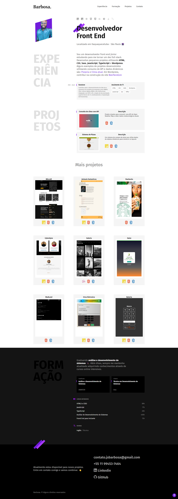

# Portfolio Barbosa

Bem-vindo ao repositório da primeira versão do portfolio 'Barbosa'! Este projeto exibe o website de portfólio de João Barbosa. Você pode explorar o site ao vivo em [https://joaosbarbosa.github.io/portfolio-barbosa/](https://joaosbarbosa.github.io/portfolio-barbosa/).

## Visão Geral do Projeto

O Portfolio Barbosa é um website estático projetado para exibir o portfólio online de João Barbosa. Ele apresenta uma interface de usuário lindamente projetada com seções para mostrar projetos, informações sobre habilidades, experiências e detalhes de contato. O site é totalmente responsivo e otimizado para diferentes tamanhos de tela, oferecendo uma experiência perfeita em desktops e dispositivos móveis.

## Tecnologias Utilizadas

- HTML5
- CSS3
- JavaScript
- Design Responsivo

## Recursos

- Página inicial com um cabeçalho acolhedor e um botão de chamada para ação proeminente.
- Seção de projetos exibindo uma seleção de trabalhos realizados com descrições.
- Seção de habilidades destacando as competências de João Barbosa.
- Página de experiências fornecendo insights sobre trabalhos anteriores.
- Página de contato com um formulário de contato e detalhes de contato.
- Design responsivo que garante uma exibição ideal em diversos dispositivos.

## Uso

Para visualizar o website ao vivo, basta seguir este link: [https://joaosbarbosa.github.io/portfolio-barbosa/](https://joaosbarbosa.github.io/portfolio-barbosa/)

## Começando

Se você deseja executar este projeto localmente ou explorar o código, siga estas etapas:

1. Clone este repositório: `git clone https://github.com/joaosbarbosa/portfolio-barbosa.git`
2. Navegue até a pasta do projeto: `cd portfolio-barbosa`
3. Abra o arquivo `index.html` em seu navegador da web preferido.

---

Obrigado por visitar o repositório do Portfolio Barbosa. Se você tiver alguma dúvida ou feedback, não hesite em entrar em contato!

